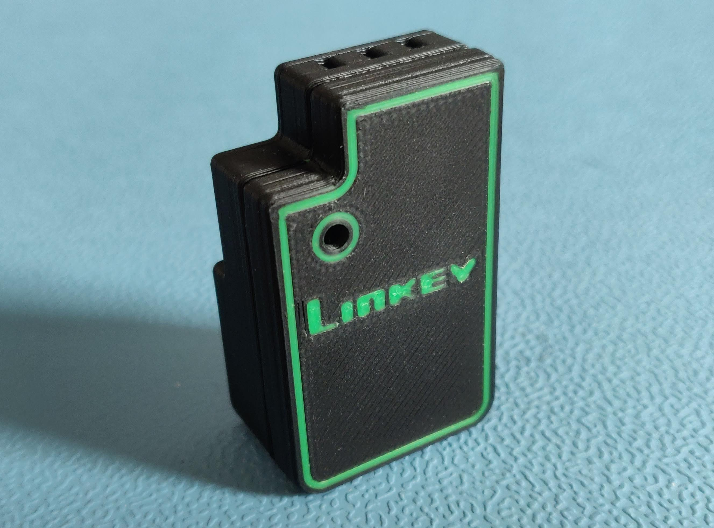
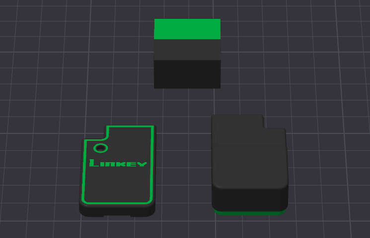

# LinKey — Boîtier

  

Boîtier imprimable en 3D pour la carte LinKey.

## Source du modèle

Le boîtier est conçu et versionné sous **Onshape**, publiquement accessible ici :

- 🔗 **Modèle Onshape** : [Linkey - boitier 3D - top & bottom](https://cad.onshape.com/documents/5972464b754aa87349b49170/w/c061eca082e853c5ff9cc07a/e/9dccff000b4ae340905eef1a?renderMode=0&uiState=6a0786d955bc7948c2b4c60c)
- Un export .STEP de la dernière version est également versionné dans ce repo.

## Téléchargements (fichiers prêts à imprimer)

2 versions de boîtiers sont disponibles au téléchargement :
- Une version d'origine bi-couleur pour les imprimantes compatibles ;
- Une version simplifiée (= retrait des liserés verts sur la face top) monochrome pour les imprimantes ne supportant pas l'impression multicolore.

Les fichiers prêts à imprimer sont attachés à la **[page Releases du dépôt](https://github.com/Konkzor/LinKey/releases)** :

| Fichier | Format | Utilisation |
|---------|--------|-------------|
| `Linkey-boitier-<vx>-top-et-bottom-bicouleur.3mf` | 3MF | Imprimantes multi-matériaux (AMS) |
| `Linkey-boitier-<vx>-top.stl` | STL | Casing top — imprimante mono-extrudeur |
| `Linkey-boitier-<vx>-bottom.stl` | STL | Casing bottom — imprimante mono-extrudeur |

## Impression

  

Paramètres testés sur le tirage ci-dessus (à ajuster selon votre imprimante / slicer) sur une imprimante Bambu Lab P2S et Bambu Studio :

| Paramètre | Valeur |
|-----------|--------|
| Matériau | PLA |
| Hauteur de couche | 0,16 mm |
| Remplissage | 15 % |
| Orientation | Extérieur du boîtier vers le haut (idem au .3mf) |
| Supports | Activé |
| Buse | 0,4 mm |

  

## Contenu du dossier

> [!NOTE]
> Les fichiers `.3mf` et `.stl` ne sont **pas versionnés dans le dépôt** : ce sont des artefacts dérivés du modèle Onshape. Ils sont publiés dans la [page Releases](https://github.com/Konkzor/LinKey/releases) pour chaque révision du boîtier.

## Licence

Voir le fichier [LICENSE](../LICENSE) à la racine du dépôt (CERN-OHL-W-2.0).
