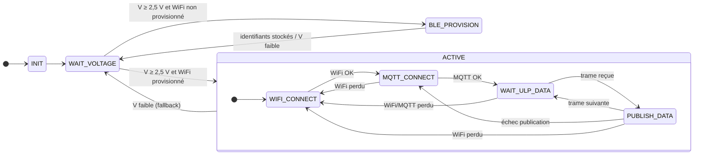
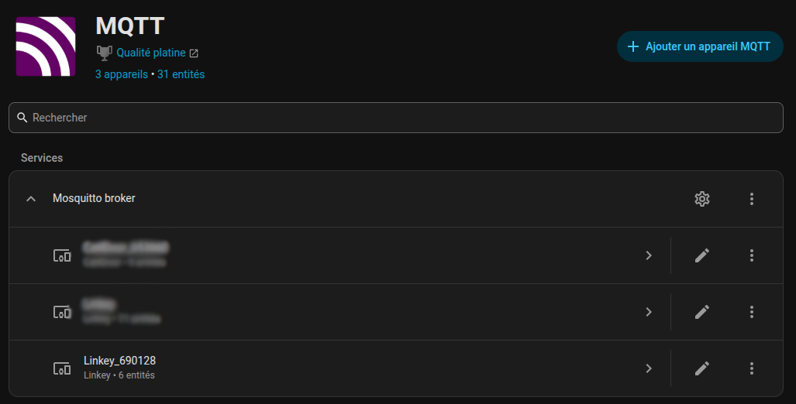
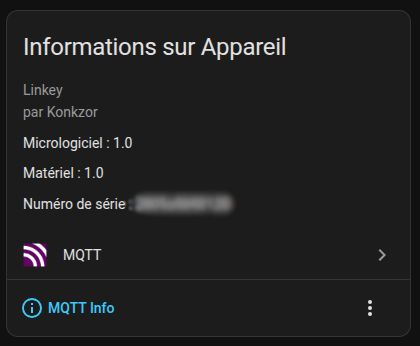
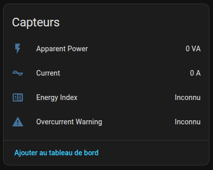

# Firmware Linkey

## Vue d'ensemble

Ce firmware utilise le coprocesseur ULP (*Ultra Low Power*) de l'ESP32 pour surveiller en continu la sortie série TIC (Télé-Information Client) du Linky (monophasé) pendant que le CPU principal reste en *light sleep*. L'ULP reçoit chaque trame TIC complète dans un buffer RTC, puis réveille le CPU principal pour publier les données via MQTT.

```
┌─────────────────────────────────────────────┐
│  CPU principal (FSM) (réveil périodique)    │
│  • Surveillance tension avec seuils de      │
│    fallback par état                        │
│  • Provisioning WiFi BLE si nécessaire      │
│  • Gestion des connexions WiFi/MQTT         │
│  • Auto-découverte HA à la connexion MQTT   │
│  • Publication JSON des données capteurs    │
│  • Modem sleep + scaling de fréquence CPU   │
└─────────────────────────────────────────────┘
                    ▲
                    │
                    │
┌─────────────────────────────────────────────┐
│  Coprocesseur ULP (toujours actif)          │
│  • Bit-bang UART à 1200 bauds (7E1)         │
│  • Trame complète (ETX) en double buffer    │
│  • Tourne en continu                        │
└─────────────────────────────────────────────┘
```

## Fonctionnalités

- **Vrai support UART 7E1** : gestion correcte des 7 bits de données + parité paire (ignorée)
- **Mode *light sleep*** : WiFi maintenu connecté, réveil rapide (à mesurer)
- **WiFi** :
  - Identifiants provisionnés en BLE via l'application Espressif
  - Stockage des identifiants dans la NVS WiFi ESP-IDF
  - Validation WiFi différée : la FSM reprend la main après le provisioning
  - Scan WiFi désactivé pendant le provisioning pour limiter le courant
  - Mise en cache du BSSID/canal pour reconnexion instantanée
  - *Fast scan*
  - *Modem sleep* WiFi pour économie d'énergie
  - IP statique optionnelle (court-circuite le DHCP)
- **MQTT** :
  - QoS 1 pour une livraison fiable et une meilleure détection des coupures WiFi
  - Délais d'expiration courts
  - *Last Will and Testament* (LWT) pour le suivi de disponibilité
  - Info de debug envoyées au broker :
     - `VCAP` : tension du supercondensateur (millivolts)
     - `uptime` : temps de fonctionnement (secondes)
- **Intégration Home Assistant** :
  - Auto-découverte MQTT (payload unique)
  - Suivi de disponibilité (online/offline)
  - Icônes et *state classes* personnalisés pour des statistiques HA correctes
- **Réception trame par trame** : l'ULP reçoit une trame TIC complète (terminée par ETX `0x03`) en double buffer RTC ping-pong, puis réveille le CPU
- **Validation de checksum** : vérifie le checksum TIC Linky `(sum & 0x3F) + 0x20`
- **Statut LED RGB** : flash bref (10 ms) à chaque itération de la FSM, couleur dépendant de l'état courant — la LED reste éteinte le reste du temps pour économiser l'énergie
- **Surveillance tension supercondensateur** : lecture de la tension du condensateur
- **Logs de debug** : journalisation verbeuse configurable pour le diagnostic

## Fonctionnement

### Machine d'état (FSM)



| État | Rôle | Couleur du flash LED |
|------|------|----------------------|
| `INIT` | Init NVS, LEDs, ADC, gestion d'énergie | Cyan |
| `WAIT_VOLTAGE` | Attend que le supercondensateur soit chargé (≥ 2,5 V) | Rouge |
| `BLE_PROVISION` | Provisioning BLE des identifiants WiFi, sans scan ni validation WiFi immédiate | Blanc |
| `WIFI_CONNECT` | Connexion WiFi (avec cache BSSID/canal), retry interne en cas d'échec | Bleu |
| `MQTT_CONNECT` | Connexion au broker MQTT + auto-découverte HA, retry interne si broker indisponible | Magenta |
| `WAIT_ULP_DATA` | Init ULP + attente d'une trame TIC complète, CPU en *light sleep* | Jaune |
| `PUBLISH_DATA` | Lecture buffer ULP, validation checksum (par groupe d'information), publication MQTT | Vert |

> **Fallback tension (`ACTIVE → WAIT_VOLTAGE`)** : dans tous les états regroupés sous `ACTIVE`, la FSM retombe vers `WAIT_VOLTAGE` si la tension descend sous `VOLTAGE_FALLBACK_MIN_MV` (1,5 V) **ou** chute de plus de 200 mV par rapport au pic atteint depuis l'entrée dans l'état (seuil dynamique). Les connexions WiFi/MQTT sont alors arrêtées.

### Provisioning WiFi BLE

Si aucun identifiant WiFi n'est présent dans la NVS WiFi ESP-IDF, la FSM entre dans l'état `BLE_PROVISION` dès que la tension du supercondensateur est suffisante. Le service BLE apparaît sous le nom `Linkey-XXXXXX`, dérivé de l'adresse MAC.

Le provisioning utilise le protocole standard de l'application Espressif, avec les contraintes basse consommation suivantes :

- Le scan WiFi demandé par l'application est remplacé par une réponse vide. Il faut donc saisir le SSID manuellement.
- Les identifiants reçus sont enregistrés dans la NVS WiFi avec `esp_wifi_set_config()`.
- Le firmware répond ensuite à l'application comme si la connexion WiFi était validée, mais ne lance pas de connexion WiFi pendant le provisioning.
- Après succès, BLE/WiFi sont arrêtés et la FSM retourne à `WAIT_VOLTAGE`. La connexion WiFi réelle est effectuée plus tard par `WIFI_CONNECT`, sous contrôle des seuils de tension.

Le *Proof of Possession* est configuré dans `menuconfig` via **Provisioning Proof of Possession**. Par défaut : `linkey-pop`.

Quand **Enable debug logging** est activé, le firmware imprime aussi un QR code compatible avec l'application Espressif dans le moniteur série. Le lien de provisioning est toujours imprimé pour faciliter le diagnostic.

### Topics MQTT

Avec le préfixe par défaut `linkey` :
- `linkey/state` — payload JSON contenant les données capteurs (seules les valeurs valides sont incluses) :
  ```json
  {"iinst":3,"base":12345678,"papp":690,"adps":30,"vcap":2850,"uptime":3600}
  ```
- `linkey/status` — disponibilité de l'appareil (`online`/`offline` via LWT)

**Note** : seules les valeurs Linky issues d'un groupe d'information avec un checksum valide **et qui ont changé depuis la dernière publication** sont incluses dans le JSON. `VCAP` et `uptime` sont toujours présents. Les index spécifiques à un tarif (HCHC/HCHP, EJPHN/EJPHPM, BBRH*) n'apparaissent que si le compteur est configuré avec le contrat correspondant.

### Home Assistant

L'appareil est auto-découvert via MQTT. À la connexion, un payload de découverte unique est publié sur :
```
homeassistant/device/linkey_<mac>/config
```

Cela enregistre l'appareil avec tous ses capteurs dans Home Assistant. Il est alors listé parmi les appareils de votre intégration MQTT :

<p align="center">
  
</p>

En cliquant dessus, vous pouvez obtenir les "Informations Appareil" de celui-ci :

<p align="center">
  
</p>

Ainsi que la liste de ses "Capteurs" :

<p align="center">
  
</p>

On y trouve entre autres :
- **Courant** (IINST) — mesure instantanée
- **Index d'énergie** (BASE, HPHC, TEMPO, etc.) — *total increasing*. Ces index sont facilement utilisables dans le tableau de bord "Energie" (une fois associés à des prix du kWh pour chaque période tarifaire)
- **Puissance apparente** (PAPP) — mesure instantanée
- **Avertissement de surintensité** (ADPS) — alerte de surcharge
- **Tension supercondensateur** (VCAP) — mesure instantanée
- **Uptime** — temps de fonctionnement en secondes

## Format des trames TIC Linky

> Source : [Enedis-NOI-CPT_54E — Sorties de télé-information client des appareils de comptage Linky](../Doc/Enedis-MOP-CPT_002E.pdf), §5.3.6 et §6.

### Couche Liaison 

Le Linky émet des **trames** en continu. Chaque trame est délimitée par `STX` (`0x02`) en début et `ETX` (`0x03`) en fin, et est composée de plusieurs **groupes d'information** :

```
STX <groupe d'info> <groupe d'info> ... <groupe d'info> ETX
```

Un groupe d'information porte une étiquette, une donnée et un checksum :

```
<LF><étiquette><SEP><donnée><SEP><checksum><CR>
```

(`LF` = `0x0A`, `CR` = `0x0D` ; le caractère `<SEP>` dépend du mode — voir ci-dessous.)

Le checksum est calculé pour chaque groupe d'information sur la zone contrôlée allant du début de l'étiquette au délimiteur précédant le checksum :

```c
uint8_t checksum = (sum_of_bytes & 0x3F) + 0x20;
```

Le résultat est toujours un caractère ASCII imprimable (entre `0x20` et `0x5F`).

Les deux modes (**historique** et **standard**) partagent cette structure ; ils diffèrent par le caractère séparateur, le débit série, la présence d'un horodatage et la liste des étiquettes émises.

### Mode historique

> Cette section n'est applicable qu'à un compteur Linky monophasé.

| | Mode historique |
|-|-|
| Débit série | 1200 bauds, 7E1 |
| Séparateur `<SEP>` | `SP` (`0x20`) |
| Horodatage | Aucun |
| Zone contrôlée par le checksum | `<étiquette><SP><donnée>` (le second `SP` est exclu) |

Exemple (corps d'une trame, sans STX/ETX) :
```
IINST 003 :
BASE 012345678 '
PAPP 00690 +
ADPS 030 !
```

**Étiquettes supportées par le firmware** :

| Étiquette | Description | Unité |
|-----------|-------------|-------|
| `IINST` | Courant instantané | A |
| `PAPP` | Puissance apparente | VA |
| `ADPS` | Avertissement de surintensité | A |
| `BASE` | Index énergie — contrat **BASE** | Wh |
| `HCHC`, `HCHP` | Index énergie — contrat **HP/HC** | Wh |
| `EJPHN`, `EJPHPM` | Index énergie — contrat **EJP** | Wh |
| `BBRHCJB`, `BBRHPJB`, `BBRHCJW`, `BBRHPJW`, `BBRHCJR`, `BBRHPJR` | Index énergie — contrat **Tempo** | Wh |

### Mode standard

> Cette section n'est applicable qu'à un compteur Linky monophasé.

| | Mode standard |
|-|-|
| Débit série | 9600 bauds, 7E1 |
| Séparateur `<SEP>` | `HT` (`0x09`) |
| Horodatage | Optionnel, intercalé entre l'étiquette et la donnée : `<LF><étiquette><HT><horodate><HT><donnée><HT><checksum><CR>` |
| Zone contrôlée par le checksum | Inclut le `HT` final (avant le checksum) |

> [!WARNING]
> Non supporté par le firmware actuel.

## Logiciel requis

- **ESP-IDF v5.4.1** ou supérieur
- **Bibliothèque HULP** (incluse en sous-module)

## Compilation et flashage

### 1. Cloner et initialiser

```bash
cd /chemin/vers/LinKey/Firmware
git submodule update --init --recursive
```

### 2. Configurer l'environnement ESP-IDF

```bash
source ~/esp/v5.4.1/esp-idf/export.sh
```

### 3. Configurer le projet

```bash
idf.py menuconfig
```

Naviguer dans **« Linkey Monitor Configuration »** et configurer :

#### Paramètres requis :
- **Device Name** : nom affiché dans Home Assistant (par défaut : `Linkey`)
- **MQTT Broker URI** : ex. `mqtt://192.168.1.100`
- **MQTT Topic Prefix** : par défaut `linkey` (topics : `linkey/state`, `linkey/status`)
- **Provisioning Proof of Possession** : code demandé par l'application Espressif

#### Paramètres optionnels :
- **MQTT Username/Password** : si votre broker requiert une authentification
- **Use Static IP** : à activer pour une connexion initiale plus rapide
- **Enable debug logging** : logs verbeux et QR code de provisioning dans le moniteur série

### 4. Compiler

```bash
idf.py build
```

### 5. Flasher

```bash
idf.py -p /dev/ttyUSB0 flash monitor
```

### 6. Provisionner le WiFi

Au premier démarrage, si aucun identifiant WiFi n'est stocké :

1. Ouvrir l'application Espressif de provisioning.
2. Scanner le QR code affiché dans le moniteur série si les logs de debug sont activés, ou sélectionner manuellement le périphérique BLE `Linkey-XXXXXX`, puis entrer le *Proof of Possession* configuré dans `menuconfig`.
3. Saisir le SSID et le mot de passe WiFi manuellement (la recherche de réseaux par l'ESP32 est volontairement désactivée).
4. L'application doit terminer avec succès. Le firmware arrête ensuite le provisioning et attend à nouveau une tension suffisante avant de se connecter au WiFi.

## Tests

Les tests unitaires *host* couvrent la logique pure extraite des modules — pour le moment uniquement `voltage_state.c` (seuils et suivi du pic dynamique). Le framework Unity est récupéré à la configuration via `FetchContent`.

### Exécuter localement

Pour exécuter les tests localement :

```bash
cd Firmware/test/host
cmake -B build
cmake --build build
ctest --test-dir build --output-on-failure
```

Temps d'exécution attendu : < 1 s pour les 13 cas actuels.

### Intégration continue (CI)

Le workflow GitHub Actions `.github/workflows/ci.yml` lance à chaque *push* et *pull request* :

1. **`host-tests`** — `ubuntu-latest`, build CMake + Unity + ctest.
2. **`firmware-build`** — image Docker `espressif/idf:release-v5.4`, `idf.py build` complet pour valider que les refactorings ne cassent pas la compilation du firmware. La matrice couvre aussi une configuration avec `CONFIG_LINKEY_DEBUG_LOGS=y`, qui active notamment le QR code de provisioning.

### Ajouter un nouveau test

Tout fichier `*_state.c` / `*_logic.c` / `*_payload.c` dans `Firmware/main/` sans `#include` ESP-IDF est testable ici. Ajouter un `test_<nom>.c` dans `Firmware/test/host/`, puis une paire `add_executable` / `add_test` dans son `CMakeLists.txt`.

### Tests qui nécessiteraient des mocks

L'approche actuelle teste uniquement la logique pure extraite. Étendre la couverture aux modules suivants imposerait de simuler tout ou partie de l'API ESP-IDF — soit avec des stubs écrits à la main (header `esp_log.h` neutralisé, etc.), soit avec un générateur comme **CMock**.

## Références

- [Bibliothèque HULP](https://github.com/boarchuz/HULP)
- [Documentation ULP ESP32](https://docs.espressif.com/projects/esp-idf/en/latest/esp32/api-reference/system/ulp.html)
- [Documentation TIC Linky](../Doc/Enedis-MOP-CPT_002E.pdf) — spécification TIC Linky (incluse dans `Doc/`)
- [Gestion d'énergie ESP32](https://docs.espressif.com/projects/esp-idf/en/latest/esp32/api-reference/system/power_management.html)
- [Découverte MQTT HA](https://www.home-assistant.io/integrations/mqtt/#mqtt-discovery)

## Licence

Le code du firmware (`Firmware/main/`) est distribué sous **licence MIT**. Voir [`Firmware/LICENSE`](LICENSE) pour le texte complet.

> [!NOTE]
> Le matériel (sources KiCad, Gerbers, modèles 3D dans `PCB/`) est distribué sous une licence distincte — **CERN-OHL-W-2.0** — voir [`LICENSE`](../LICENSE) à la racine du dépôt.

### Dépendances tierces

- **HULP** (`Firmware/HULP/`, sous-module Git) — [MIT](HULP/LICENSE), © 2019 Matt
- **ESP-IDF** — [Apache 2.0](https://github.com/espressif/esp-idf/blob/master/LICENSE)
- **espressif/qrcode** (`Firmware/main/idf_component.yml`) — composant ESP-IDF utilisé uniquement par les builds avec logs de debug pour afficher le QR code de provisioning
