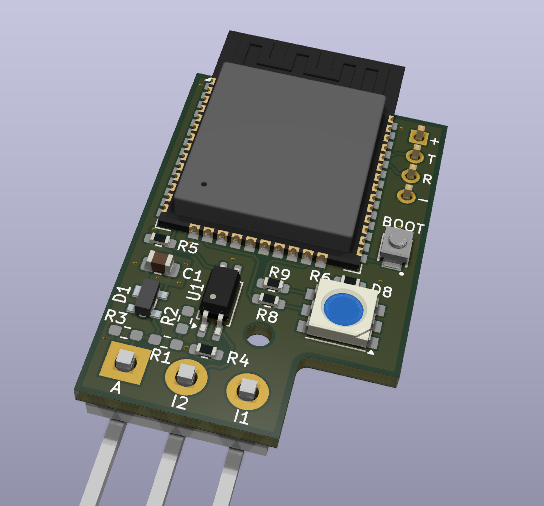
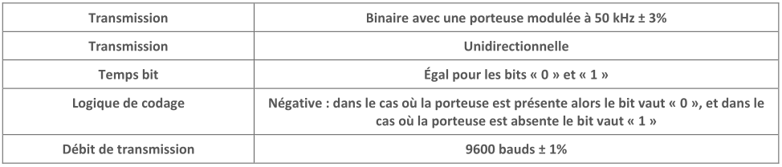
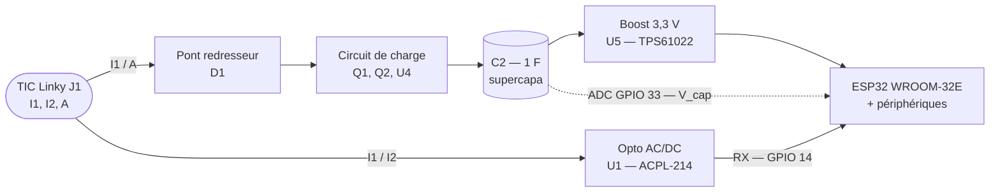
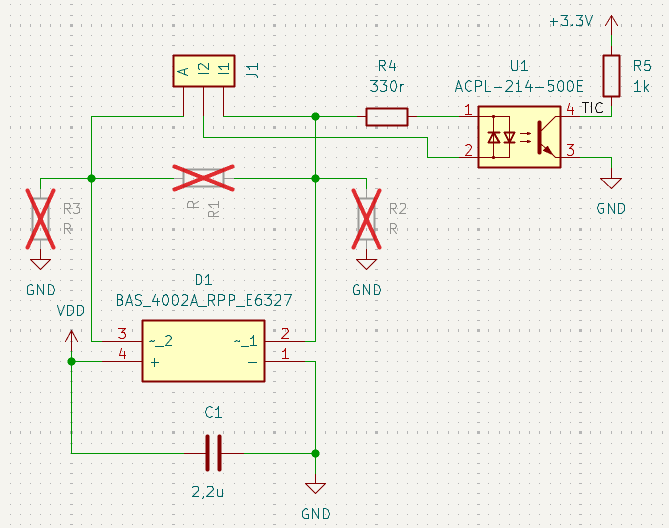
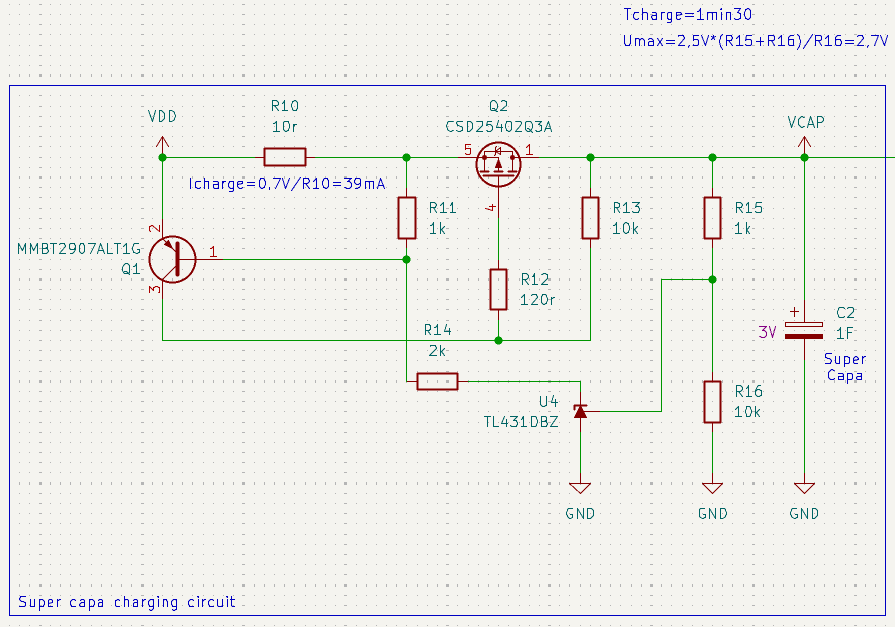
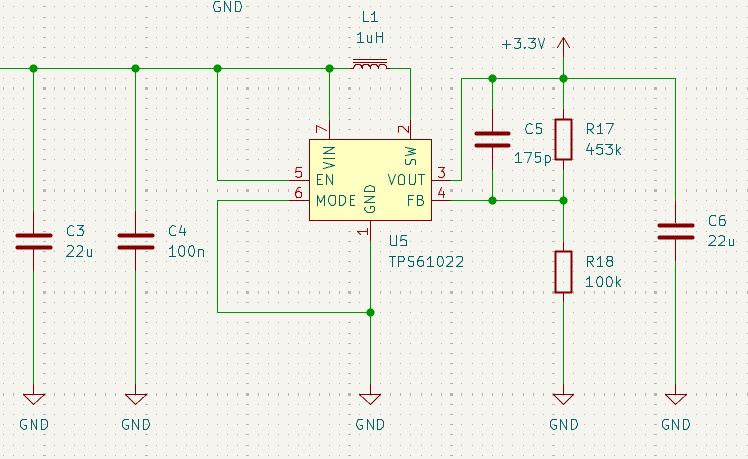
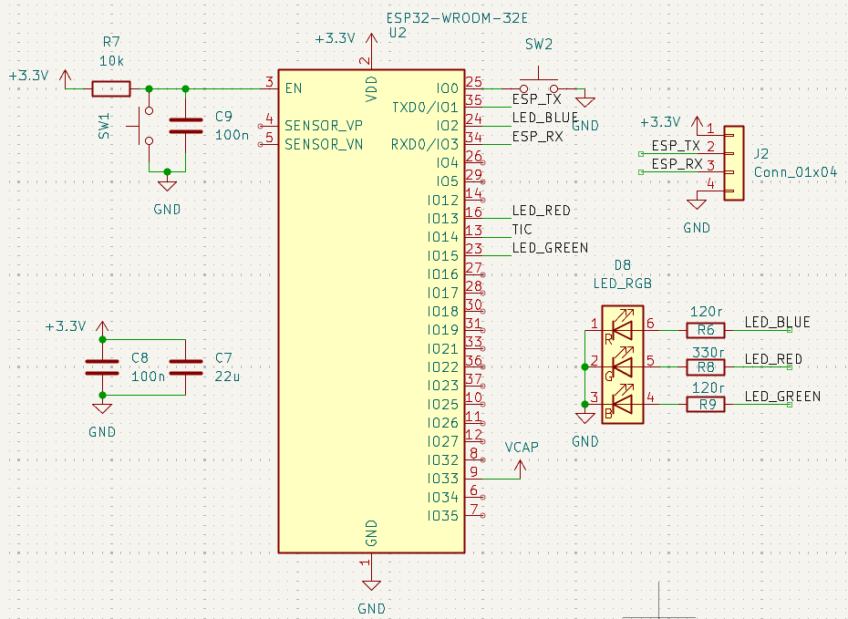

# LinKey — Carte électronique

  

Sources matérielles de la carte LinKey : projet KiCad, Gerbers et nomenclature.

Révision actuelle : **v1.1**.

## Couche physique de la TIC Linky

> Source : [Enedis-NOI-CPT_54E](../Doc/Enedis-MOP-CPT_002E.pdf), §5.3.1 *Caractéristiques des signaux* (Table 3).

La sortie TIC du compteur Linky se présente sur le bornier client sous forme de **trois bornes** (`I1`, `I2`, `A`) : la paire `I1`/`I2` véhicule les **données**, et la paire `I1`/`A` est dédiée à l'**alimentation parasite** des récepteurs. Le compteur émet sur ce bus un **signal binaire modulé par tout-ou-rien sur une porteuse 50 kHz ± 3 %** (Table 3 de la spec Enedis), avec une **logique de codage négative** (porteuse présente ⇒ « 0 », porteuse absente ⇒ « 1 ») et une transmission **unidirectionnelle**.

  

> [!WARNING]
> Bien que les niveaux soient bas, le bus TIC reste relié au compteur — une **isolation galvanique côté récepteur reste obligatoire** pour la sécurité utilisateur et la conformité. C'est le rôle de l'optocoupleur (voir l'étage d'entrée ci-dessous).

Le bus est connecté à la carte via le connecteur **`J1`** (Samtec **HPM-03-04-T-S**, header 3 broches, pas 5 mm, sortie à angle droit).

## Architecture du PCB

L'architecture du PCB est composée de 2 branches principales :

- **Branche supérieure** : chemin d'alimentation, sur les bornes **`I1` / `A`** du Linky → pont redresseur → circuit de charge supercapa → `C2` → boost 3,3 V → ESP32.
- **Branche inférieure** : chemin de données, sur les bornes **`I1` / `I2`** du Linky → optocoupleur → ESP32.

Remarque : En **trait pointillé** la mesure de la tension du supercondensateur par l'ESP32.

### 1. Étage d'entrée

Sépare et conditionne les deux fonctions du bus TIC.

- **Démodulation des données** — `U1` (Broadcom **ACPL-214-500E**, opto **AC** SOP-4) extrait directement l'enveloppe de la porteuse 50 kHz et fournit un signal UART démodulé côté ESP32 (pull_up `R5` incluse), tout en assurant l'isolation galvanique.
- **Pont redresseur d'alimentation** — `D1` (Infineon **BAS 4002A RPP E6327**, array de Schottky basse Vf) forme un pont à quatre diodes dans un seul boîtier qui rectifie la porteuse 50 kHz pour alimenter le reste de la carte.

  

### 2. Circuit de charge du supercondensateur

Stocke l'énergie disponible pour absorber les pics de consommation pendant l'émission WiFi/MQTT. Limite le courant et la tension de charge.

- **Supercondensateur** — `C2` (KYOCERA AVX **SCCR12E105SRB**, 1 F / 3 V, ESR faible, radial 8×12 mm).
- Limitation de courant et tension contrôlant la tension Vgs de `Q2` (TI **CSD25402Q3A**, P-MOSFET 20 V) :
  - **Limitation de courant** — `Q1` (ON Semi **MMBT2907A**, PNP 60 V / 0,6 A) conjugué à `R10` (10 Ω) qui fixe le seuil de courant débité par l'étage d'entrée vers la supercapa à environ  40 mA.
  - **Limitation de tension** — `U4` (TI **TL431**, référence shunt ajustable) clampe la tension de charge à 2,7V de la supercapa (seuil réglé par `R15` et `R16`).

  

### 3. Alimentation 3,3 V (boost)

Convertit la tension variable du supercondensateur (0 V → 2,7 V) en un rail 3,3 V stable pour l'ESP32.

- **Convertisseur** — `U5` (TI **TPS61022**, boost synchrone 8 A pic, **démarrage à 1,5 V, maintien jusqu'à 0,5 V**) : on peut tirer du jus de la supercapa presque jusqu'à le vider complètement.
- **Inductance** — `L1` (Coilcraft **XEL5030-102MEC**, 1 µH), recommandée par TI.
- **Capacités** — `C3`, `C4` pour l'entrée, `C6` (22 µF / 10 V X7R 1206) pour la sortie.
- **Pont diviseur** — `R17` (453 k) / `R18` (100 k) pour régler la sortie à 3,3 V.

  

### 4. ESP32 et périphériques

- **MCU** — `U2` (Espressif **ESP32-WROOM-32E-N8**, 8 MB flash SPI, antenne PCB intégrée). Module choisi pour sa disponibilité du **coprocesseur ULP** que le firmware utilise pour décoder la TIC pendant le *light sleep*.
- **Découplage** — `C8` (100 nF), `C7` (22 µF).
- **Interface programmation/debug** — `J2` (header 4 broches, pas 2,54 mm) expose `TX`, `RX`, `GND`, `3V3` pour le flashage et le debug.
- **Boutons** — deux boutons tactiles Omron **B3U-1000P** :
  - `SW1` — **RESET**, raccordé sur la broche `EN` de l'ESP32 (tient le module en reset tant qu'il est pressé).
  - `SW2` — **BOOT**, raccordé sur `IO0` ; à maintenir pendant un reset pour entrer en mode flashage.
- **LED d'état RGB** — `D8` (American Bright **BL-HBXJXGX32L**, 5050 PLCC6) avec ses résistances de limitation `R6` (120 Ω) / `R8` (330 Ω) / `R9` (120 Ω) sur les trois canaux B/R/G respectivement. Pilotée par GPIO 2 / 13 / 15 ; flash bref de 10 ms à chaque itération de la FSM (voir `Firmware/README.md`).

  

## Affectation des broches (ESP32)

| Fonction | GPIO |
|----------|------|
| RX TIC Linky | 14 |
| ADC tension supercondensateur | 33 |
| LED RGB Rouge | 13 |
| LED RGB Verte | 15 |
| LED RGB Bleue | 2 |
| RX UART ESP | 3 |
| TX UART ESP | 1 |

## Contenu du dossier

| Fichier / dossier | Description |
|-------------------|-------------|
| [`LinKey.kicad_pro`](LinKey.kicad_pro) | Projet KiCad 9 |
| [`LinKey.kicad_sch`](LinKey.kicad_sch) | Schéma |
| [`LinKey.kicad_pcb`](LinKey.kicad_pcb) | Routage |
| [`fab-output.kicad_jobset`](fab-output.kicad_jobset) | Jobset KiCad décrivant les sorties de fabrication générées en CI |
| [`MCAD files/`](MCAD%20files/) | Modèles 3D des composants (STEP) |
| [`LinKey_Lib_Footprints.pretty/`](LinKey_Lib_Footprints.pretty/) | Bibliothèque d'empreintes du projet |
| [`LinKey_Lib_Symbols.kicad_sym`](LinKey_Lib_Symbols.kicad_sym) | Bibliothèque de symboles du projet |

## Fabrication

Les fichiers de fabrication ne sont **pas versionnés** : ils sont régénérés à chaque push par le workflow GitHub Actions [`.github/workflows/ci.yml`](../.github/workflows/ci.yml) (job `pcb-fab`) à partir du jobset [`fab-output.kicad_jobset`](fab-output.kicad_jobset), et publiés en tant qu'artefact nommé **`fab`** sur l'exécution correspondante.

Contenu de l'artefact `fab` :

| Fichier | Description |
|---------|-------------|
| `gerbers/LinKey-F_Cu.gbr`, `B_Cu.gbr`, `In1_Cu.gbr`, `In2_Cu.gbr` | Couches cuivre (4 couches) |
| `gerbers/LinKey-F_Mask.gbr`, `B_Mask.gbr` | Masques de soudure |
| `gerbers/LinKey-F_Paste.gbr`, `B_Paste.gbr` | Pochoir pâte à braser |
| `gerbers/LinKey-F_Silkscreen.gbr`, `B_Silkscreen.gbr` | Sérigraphies |
| `gerbers/LinKey-Edge_Cuts.gbr` | Contour de la carte |
| `gerbers/LinKey-job.gbrjob` | Métadonnées Gerber X2 (stackup) |
| `LinKey-PTH.drl`, `LinKey-NPTH.drl` | Perçages (plaqués / non plaqués) |
| `LinKey_positions-all.csv` | Fichier de positions (pick & place) |
| `LinKey_Bill_of_Materials.csv` | Nomenclature (BOM) |

Pour récupérer l'archive : ouvrir l'exécution CI sur GitHub → onglet *Summary* → section *Artifacts* → **`fab`**.

## Consommation

- ***Light sleep*** : à mesurer
- **Actif (publication)** : à mesurer
- **Moyenne** : à mesurer

## Licence

Voir le fichier [LICENSE](../LICENSE) à la racine du dépôt (CERN-OHL-W-2.0).
