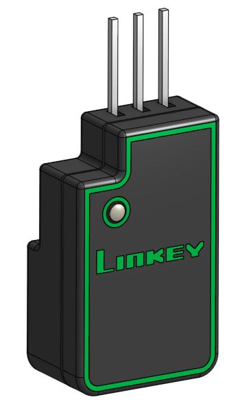

<p align="center">
  
</p>

[](https://github.com/Konkzor/LinKey/actions/workflows/ci.yml)
[](Firmware/LICENSE)
[](LICENSE)
[](https://docs.espressif.com/projects/esp-idf/en/v5.4/)

Moniteur **open-hardware** basse consommation à base d'ESP32 pour le compteur électrique **Linky**, avec intégration native à **Home Assistant** via MQTT.

LinKey (jeu de mot) lit la sortie série TIC (Télé-Information Client) du Linky et publie les mesures de puissance, d'énergie et de courant vers le broker MQTT de votre Home Assistant. Le coprocesseur ULP de l'ESP32 décode la trame TIC pendant que le CPU principal reste en *light sleep*, ce qui maintient une consommation moyenne suffisamment faible pour fonctionner sur l'alimentation de la TIC via une supercapa.

## Fonctionnalités

- Décodage UART 7E1 (1200 bauds) par le coprocesseur ULP de l'ESP32
- Boucle principale en *light sleep* avec *modem sleep* WiFi
- Publication MQTT en QoS 1, *Last Will and Testament* et auto-découverte Home Assistant
- Alimentation par supercapa avec surveillance de tension intégrée
- Retour visuel par LED RGB
- Compatible contrats BASE, HP/HC, Tempo et EJP
- Mode TIC historique (standard à venir)

## Structure du dépôt

```
.
├── CAO/        Boîtier imprimable 3D (source STEP + modèle Onshape)
├── Doc/        Spécification TIC Linky et documents de référence
├── Firmware/   Projet ESP-IDF (ULP + machine d'état CPU, WiFi/MQTT)
└── PCB/        Projet KiCad, schéma, Gerbers

```

## Documentation

- [Guide du firmware](Firmware/README.md) — compilation, flashage, configuration, topics MQTT, découverte HA
- [Guide de la carte (PCB)](PCB/README.md) — composants, brochage ESP32, connexion TIC, fabrication
- [Guide du boîtier (CAO)](CAO/README.md) — source Onshape, STEP, paramètres d'impression
- [Spécification TIC Linky](Doc/Enedis-MOP-CPT_002E.pdf) — document de référence Enedis

## Firmware

Le firmware est un projet ESP-IDF situé dans [`Firmware/`](Firmware/). Consultez [`Firmware/README.md`](Firmware/README.md) pour le guide complet de compilation, flashage et configuration.

Démarrage rapide :

```bash
git clone --recurse-submodules https://github.com/Konkzor/LinKey.git
cd LinKey/Firmware
source ~/esp/v5.4.1/esp-idf/export.sh
idf.py menuconfig    # Configurer vos credentials WiFi et MQTT
idf.py -p /dev/ttyUSB0 flash monitor
```

## PCB

Le PCB a été réalisé sous KiCad 9.

<p align="center">
  
</p>

Les sources de la carte se trouvent dans [`PCB/`](PCB/). Voir [`PCB/README.md`](PCB/README.md) pour une description des composants, le brochage de l'ESP32 et la connexion TIC.

- Projet KiCad : [`PCB/LinKey.kicad_pro`](PCB/LinKey.kicad_pro)
- Modèles 3D de certains composants : [`PCB/MCAD files/`](PCB/MCAD%20files/)

> Note : Les fichiers de fabrication et la nomenclature ne sont pas versionnés dans le repo. Ils sont disponibles en artefacts des jobs de la CI ainsi que dans la [page Releases](https://github.com/Konkzor/LinKey/releases) pour les versions taguées.

## CAO

Le boîtier est conçu sous Onshape et imprimable en 3D.

<p align="center">
  
</p>

Les sources se trouvent dans [`CAO/`](CAO/). Voir [`CAO/README.md`](CAO/README.md) pour le lien vers le modèle Onshape et les paramètres d'impression conseillés.

- Source CAO neutre (STEP) ;
- Fichiers prêts à imprimer (3MF multicolore, STL mono-couleur) : [page Releases](https://github.com/Konkzor/LinKey/releases).

## Licence

Ce projet utilise une **double licence** selon la nature des fichiers :

### Matériel — CERN-OHL-W-2.0

Le matériel (`PCB/` : sources KiCad, Gerbers… et `CAO/` : modèles 3D du boîtier, pièces mécaniques) est distribué sous **CERN Open Hardware Licence Version 2 – Weakly Reciprocal (CERN-OHL-W-2.0)**.

Vous êtes libre d'utiliser, d'étudier, de modifier et de fabriquer ce matériel.
Si vous modifiez les fichiers de conception eux-mêmes, vous devez publier ces modifications sous la même licence.
En revanche, vous n'êtes pas tenu de publier les sources de produits plus larges qui ne font qu'incorporer cette conception.

Texte complet : [`LICENSE`](LICENSE) (EN).

### Firmware — MIT

Le code du firmware (`Firmware/main/`) est distribué sous **licence MIT**, plus permissive et adaptée au logiciel.

Texte complet : [`Firmware/LICENSE`](Firmware/LICENSE) (EN).
